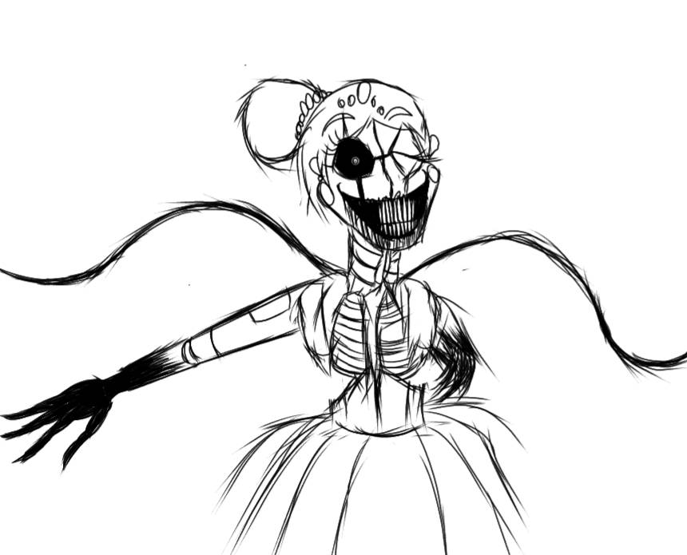
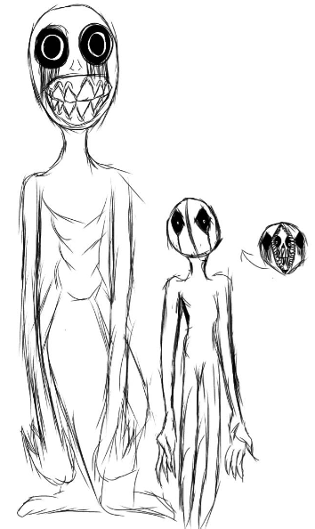

<h2> ¿Que es la Hibridación de Medios?</h2>

Para empezar, es imprescindible introducir el [concepto de hibridación  (Ferran Adell)](http://multimedia.uoc.edu/blogs/fem/es/remediacio-multimedia-i-hibridacio-dels-mitjans/), que va más allá de la simple multimedia. La hibridación implica la fusión de diferentes medios clásicos y nuevos, creando nuevas experiencias que coexisten y se amalgaman en una entidad singular creando una fusión que lo convierte en una nueva experiencia. 

Un ejemplo destacado de este concepto es la película [Bandersnatch (2018)](https://www.youtube.com/watch?v=VNw9DAwp2Kk), que incorpora elementos interactivos que transforman al espectador de un sujeto pasivo, a un participante activo en la construcción de la historia. Asimismo, en los videojuegos se utilizan cinemáticas estratégicamente para brindar coherencia narrativa, permitiendo al jugador experimentar la trama de manera activa asumiendo el papel protagonista desde la perspectiva de un actor, inmerso en la historia.

Un ejemplo de este tipo de videojuegos es [Quantum Break](https://www.xbox.com/es-ES/games/store/quantum-break/9nblggh6h0rv), desarrollado por Remedy Entertainment y lanzado en 2016 (Remedy Entertainment, 2016).

Una vez visto el concepto de hibridación y unos ejemplos, que creo son bastante representativos del concepto de hibridación de Manovich intentare demostrar el concepto de hibridación en dos casos particulares con las gafas de Manovich.

 <h3>Caso 1. The Backrooms (Found Footage). </h3>
 
 Antes de adentrarnos en este caso, es importante proporcionar una explicación sobre los conceptos de "*found footage*" y "*creepypasta*". El género de "found footage" (metraje encontrado) se refiere a películas o videos que pretenden ser grabaciones reales y documentales descubiertos después de un evento sobrenatural o perturbador. Estos videos suelen presentar imágenes de baja calidad, cámara temblorosa y una estética amateur para aumentar la sensación de realismo.

  

 
 
 

“Creepypasta” es un término que se utiliza para describir historias de terror, leyendas urbanas o narrativas de horror que se difunden en línea. Estas historias suelen ser ficticias y se comparten a través de plataformas como foros, redes sociales, blogs o sitios web especializados en este tipo de contenido.
 
La hibridación ocurre en la mezcla de elementos narrativos y estilísticos del creepypasta original con la estética y el formato característicos del género "found footage". El autor del video, al presentar "The Backrooms" en formato de "found footage", quiere generar una mayor sensación de inmersión y realismo para los espectadores. También el uso de imágenes de baja calidad, sonido ambiente perturbador y otros elementos característicos del género contribuye a la experiencia y puede intensificar el impacto emocional en comparación con la simple narración escrita del creepypasta. 

También podemos ver hibridación en las dinámicas de creación y consumo de contenido, así como la formación de comunidades en torno a esta forma de expresión tanto de fanáticos de este "submundo" como creadores de contenido. En estas dinámicas, se puede ver cómo las redes sociales, con el feedback de los usuarios, han expandido la historia original a través de ilustraciones, adaptaciones de video y otros medios. Esta participación activa y la creación de contenido adicional basado en el creepypasta también pueden considerarse una forma de hibridación, ya que fusiona la historia original con nuevas expresiones artísticas y medios de comunicación. 

En  "*El software toma el mando*", de Lev Manovich comenta una obra llamada "Crystal World” de Lislegaard (2006) en la que existe un cierto paralelismo con "The Backrooms". En los dos casos exploran la creación de mundos alternativos , lo desconocido y la fusión de elementos naturales y artificiales creando una nueva estética de híbridos.

Como conclusión y basandome en el capítulo 3 de "The Language of New Media" de Lev Manovich, se pueden identificar varias estrategias de hibridación. Una de ellas es, la forma de representar los personajes en "Backrooms" donde se combina elementos de cómic y mapa. Esta mezcla de formatos visuales crea una representación híbrida que combina características de ambos medios. Además, se presenta una nueva forma de interacción con los medios a través de acertijos. Los usuarios pueden moverse de un lugar a otro del mundo dentro del juego mediante la resolución de acertijos, lo que añade una dimensión interactiva a la experiencia de juego.

A continuación, podemos ver algunas ilustraciones de la comunidad.

 &nbsp;&nbsp;&nbsp;&nbsp;&nbsp;&nbsp;&nbsp;&nbsp;&nbsp;&nbsp;&nbsp;&nbsp;&nbsp;&nbsp;&nbsp;&nbsp;&nbsp;&nbsp;&nbsp; &nbsp;&nbsp;&nbsp;&nbsp;&nbsp;&nbsp;&nbsp;&nbsp;&nbsp;&nbsp;&nbsp;&nbsp;&nbsp;&nbsp;&nbsp;&nbsp;&nbsp;&nbsp;&nbsp;
 
 

 
En una reciente entrevista *Lomeña, Andrés. (2020). El mundo digital según Lev Manovich: Una entrevista larga y duradera a este visionario*. En esta entrevista introduce un nuevo concepto de “escala” y comenta en la entrevista que:
 <blockquote>La nueva escala de la cultura se manifiesta tanto de forma online como en el mundo físico</blockquote>
 
Pues en este caso ocurre lo mismo que comenta Manovich, podemos presenciar cómo una historia se expande y toma forma gracias a la colaboración de comunidades de creadores, que generan una historia comunitaria retroalimentada y en constante evolución. Es complicado por no decir imposible seguir la cantidad de creaciones que aporta la comunidad.

<h3>Caso 2. Chamilo LMS</h3>   
 

En el caso de Chamilo LMS, se trata de un LMS de código abierto que combina características de aprendizaje en línea y presencial. Proporciona una plataforma virtual que permite a los estudiantes acceder a recursos educativos, participar en actividades interactivas, realizar evaluaciones y colaborar con sus compañeros y profesores en un entorno virtual.

Además, Chamilo LMS facilita la interacción y la colaboración entre los estudiantes y los docentes a través de diversas herramientas, como foros de discusión, chat en vivo y herramientas de colaboración en línea. Esto fomenta un ambiente de aprendizaje colaborativo, donde los participantes pueden compartir ideas, resolver problemas y construir conocimiento juntos, sin importar su ubicación geográfica.

Otro aspecto de hibridación en Chamilo es su capacidad para integrar diferentes tipos de contenido y formatos, como videos, presentaciones, documentos, cuestionarios, entre otros. Esto permite una variedad de recursos y enfoques pedagógicos, adaptándose a diferentes estilos de aprendizaje y preferencias.

El software incluye características de interacción social, como foros de discusión, chat en vivo y herramientas de colaboración. Estas funcionalidades permiten a los estudiantes y profesores interactuar y comunicarse en un entorno en línea, fusionando elementos de la comunicación interpersonal con el entorno digital.

Manovich (2013) ha discutido ampliamente sobre el concepto de hibridación en relación con la fusión de diferentes elementos o tecnologías para crear algo nuevo y mejorado. Chamilo LMS permite a los usuarios personalizar la experiencia de aprendizaje según sus necesidades y preferencias.

Esto implica la combinación de diferentes elementos y recursos de aprendizaje para adaptarse a las características individuales de cada estudiante, lo cual se puede considerar como una forma de hibridación en la creación de un entorno de aprendizaje personalizado. 

Chamilo LMS aporta una interfaz clara sencilla desde la instalación lo que favorece el acceso a herramientas de LMS para todos los públicos, sin necesidad de depender de un programador para parametrizar las herramientas. Esta sencillez es tambien un rasgo de hibridación. 

Chamilo combina la simplicidad de uso con las funcionalidades avanzadas de un sistema de gestión del aprendizaje. Esta combinación permite que una amplia variedad de usuarios, independientemente de sus habilidades técnicas, puedan aprovechar las herramientas de LMS y participar en experiencias de aprendizaje en línea.
  
  

    
Interfaz Chamilo
 
    

 

<h2>Conclusión</h2>

La hibridación es un fenómeno que trasciende los límites de los medios tradicionales y permite la creación de nuevas formas de expresión y experiencia. A través de la combinación de diferentes elementos, tecnologías y la participación activa de los usuarios, se generan experiencias híbridas que desafían las convenciones y enriquecen la cultura contemporánea. 

Estos casos anteriores ejemplifican cómo la hibridación impulsa la innovación y la creatividad en diversos ámbitos, abriendo nuevas posibilidades para la comunicación, el arte, el entretenimiento y la educación.

Bajo mi punto de vista, esta forma de creación social de contenidos seguramente sería abordada por Manovich. Es increíble el poder de la comunidad para generar contenido de una historia que difumina lo real y lo imaginario. Aunque es una tarea ingente debido a la cantidad de contenido, se pueden extraer conclusiones muy interesantes.

<h2>Referencias</h2>

[Adell, F. (Año). Remediación, multimedia e hibridación de los medios. Nombre del sitio web. Recuperado de [http://multimedia.uoc.edu/blogs/fem/es/remediacio-multimedia-i-hibridacio-dels-mitjans/]](http://multimedia.uoc.edu/blogs/fem/es/remediacio-multimedia-i-hibridacio-dels-mitjans/)

[Lomeña, A. (2020). El mundo digital según Lev Manovich: Una entrevista larga y duradera a este visionario. Recuperado de [https://www.huffingtonpost.es/entry/el-mundo-digital-segun-lev-manovich_es_5e2b365fc5b6d6767fd3a1f3.html]](https://www.huffingtonpost.es/entry/el-mundo-digital-segun-lev-manovich_es_5e2b365fc5b6d6767fd3a1f3.html)

[Manovich, L. (2013). El software toma el mando. Ediciones UOC.](https://www.amazon.es/Software-toma-mando-UOCPress-Comunicaci%C3%B3n/dp/8490298637)

[Pixels, K. (2022). *The Backrooms (Found Footage)* . Recuperado de [https://www.youtube.com/watch?v=H4dGpz6cnHo] ](https://www.youtube.com/watch?v=H4dGpz6cnHo)

<h2>Referencias adicionales</h2>

[Remedy Entertainment. (2016). Quantum Break [Videojuego]. Microsoft Windows, Xbox One](https://www.xbox.com/es-ES/games/store/quantum-break/9nblggh6h0rv)

[Brooker, W. (2019). Black Mirror: Bandersnatch . Netflix](https://www.youtube.com/watch?v=VNw9DAwp2Kk)

[Lislegaard, A. (2006). Crystal World](https://www.youtube.com/watch?v=CqNV28AK894)

[Comunidad hispana de backrooms](http://es-backrooms-wiki.wikidot.com/)

<h2>Atribuciones</h2>

[Designed by starline / Freepik](http://www.freepik.com)
 
 
